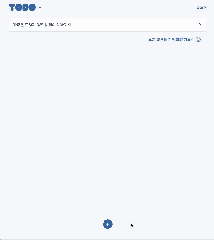
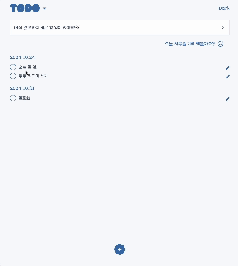
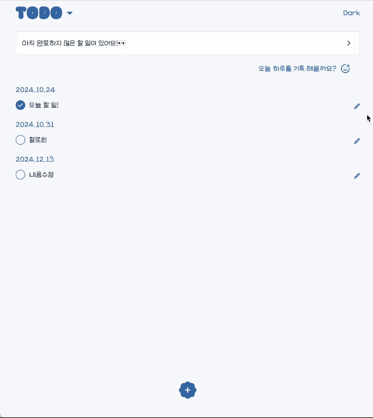

## 하루모음 (Todo And Diary)

### 프로젝트 소개

[배포링크](https://harumoeum.netlify.app/)

Todo리스트와 오늘의 감정에 따라 이모티콘을 선택해 일기를 쓸 수 있는 어플리케이션 입니다.

### 기술스택

- Firebase, React, React-Query, tailwind-css
- 전역상태는 내장 api인 context를 사용했습니다.

### 데모영상

**TODO**

<table>
  <tr>
    <th style="width: 50%; text-align: center;">TODO 작성</th>
    <th style="width: 50%; text-align: center;">TODO 수정</th>
  </tr>
  <tr>
    <td style="text-align: center;">
      
       
      날짜 등을 지정해TODO을 작성할 수 있습니다.
    </td>
    <td style="text-align: center;">
      
       
      체크 표시 및 날짜, 텍스트 수정이 가능합니다.
    </td>
  </tr>
  <tr>
    <th style="width: 50%; text-align: center;">TODO 삭제</th>
    <th style="width: 50%; text-align: center;">Pending page</th>
  </tr>
  <tr>
    <td style="text-align: center;">
      
       
      수정 버튼을 누른 후, 쓰레기통 아이콘을 누르면 할 일을 삭제할 수 있습니다.
    </td>
    <td style="text-align: center;">
      
       
      drag & drop 이벤트를 이용해 특정 영역에 넣으면 지난 할 일들을 삭제할 수 있습니다.
       
      지난 할일 리스트가 없다면 pendingBox는 사라집니다.
    </td>
  </tr>
</table>
